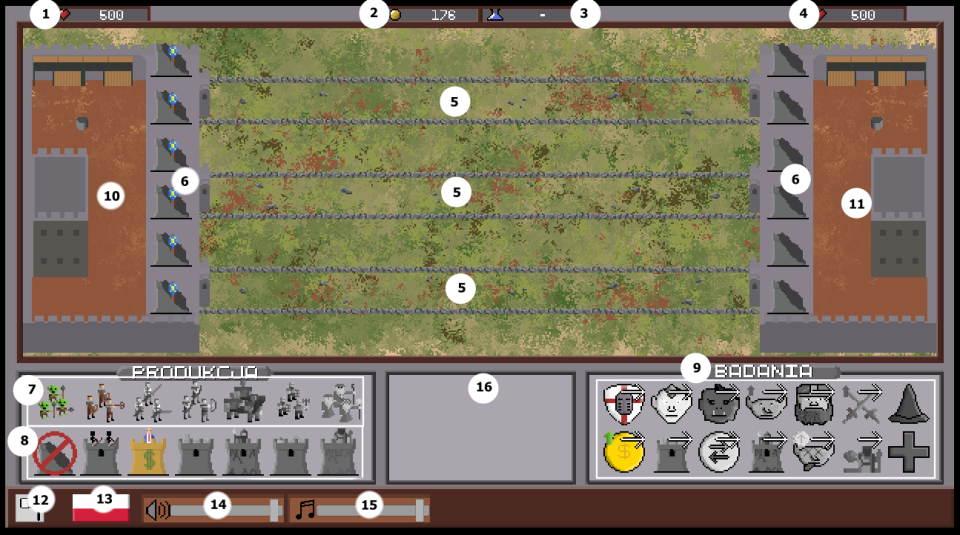

# PathFighters

## About

PathFighters is a game with login system and REST API with multiplayer gameplay where you face other player in a duel. Games takes aproximatly 15 minutes. Game core is three lanes and two bases where one belongs to you and other to oponent that you joined to. You can choose from variety of minions/soldiers to attack or place towers to defend yourself from oponent. Each unit has different stats and abilities as well as price. Also there is possibility to upgrade your units and towers under uprade menu. Main goal is to take down oponent base and win the game.
Game was made as a part of university project.

### Used technologies

Here is a list of technologies used in this project:

- Python 3
- Unity with C# Scripts
- Mirror Networking for Unity as synchronization tool
- Flask
- SQLAlchemy
- Swagger API documentation for better understanding of API
- Pytest
- Docker
- Docker Compose

### How to run game

To run the game simply use provided .exe file in the releases zip.

### Description of game

Here is a brief description of the game elements that can be found while playing the game.

1. Player 1 health points
2. Current gold that is different depending on player
3. Time left to finish finish the research
4. Player 2 health points
5. Lanes that can be used to send units by selecting unit in the box and clicking on the lane
6. Towers that can be placed and removed
7. Units that can be created
8. Towers that can be build
9. Avaible researches
10. Player 1 base
11. Player 2 base
12. Surrender button/leave from the game
13. Language selector
14. Volume change for game sounds
15. Music volume change
16. Help box where information about hovered element is displayed

### How to run API and server

All of neccesery files for running server side are compressed into a single `docker-compose.yml` that is found within this repository. All that can change in configuration is the volume in the `path-fighters-api` container and port in `path-fighters-server-api` container.
 To run all just type in console `docker-compose up` command with optional `-d` for this being detached.
